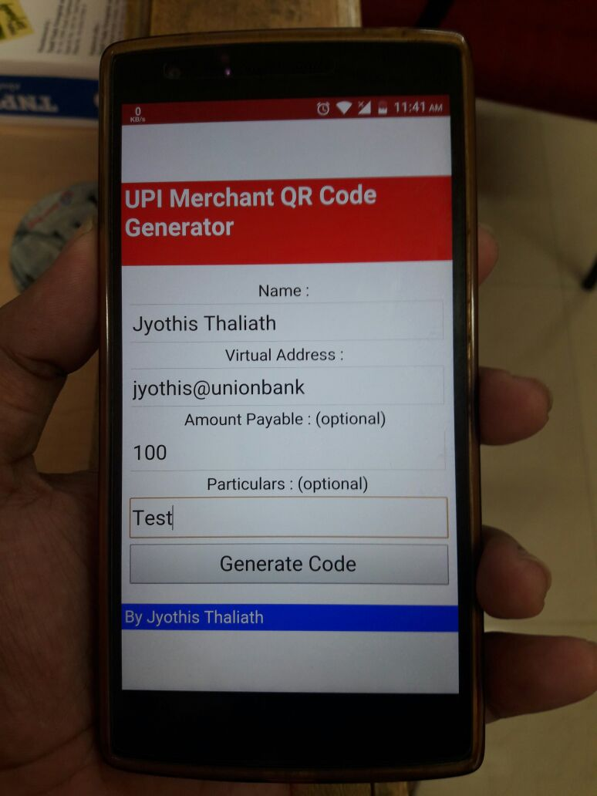
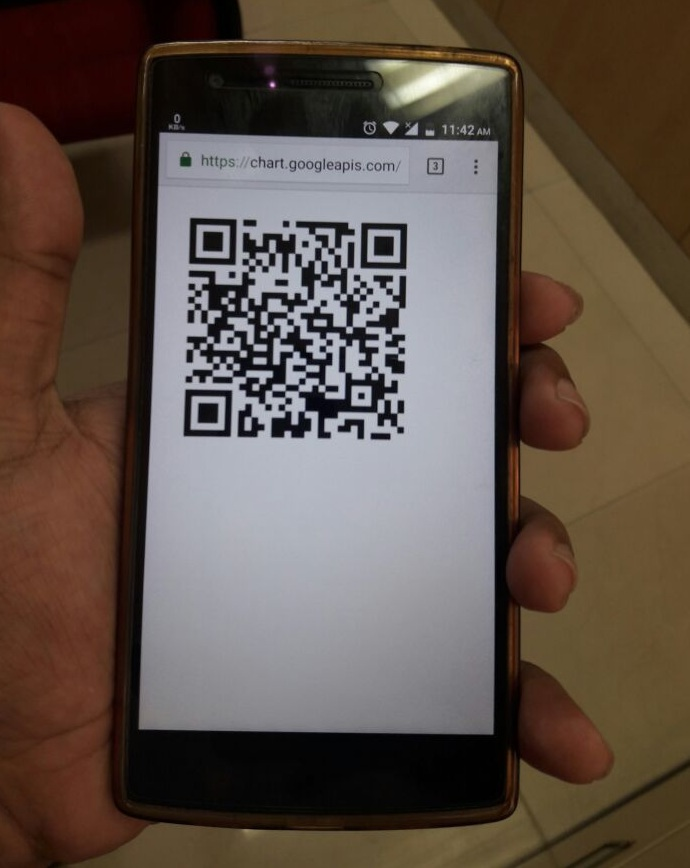
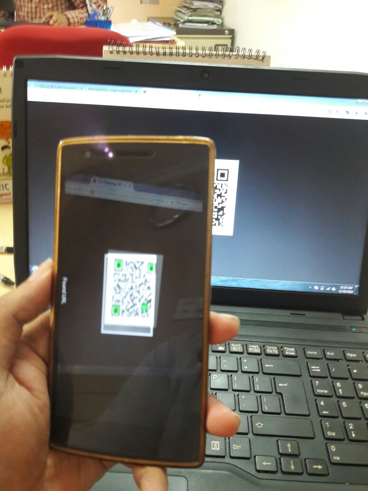

# 🔗 UPI Merchant QR Code Generator

> **📦 Archive Project** — This repository is preserved for historical reference. The web app source is fully functional and can be run locally in any browser.


A tool built in **2016** to help small-scale retailers generate UPI payment QR codes — right after India's demonetization — at a time when major UPI apps hadn't yet built this feature natively.

---

## 📖 The Story

Shortly after India's demonetization in November 2016, many retailers adopted SBI Buddy and Paytm for cashless payments. However, both required the payer to maintain a prepaid wallet with that specific provider.

The arrival of **UPI (Unified Payments Interface)** changed everything — allowing payments directly from a bank account. But in those early days, UPI was purely VPA-based with no QR scanning like Paytm offered.

This app bridged that gap — giving any retailer a simple way to generate a UPI QR code on a phone or computer, which customers could scan to pay instantly.

> 📝 Read the full story → [docs/blog.md](docs/blog.md)

---

## ✨ Features

- Generate UPI payment QR codes for any merchant
- **Bill Mode** — QR with a specific amount pre-filled
- **Poster Mode** — QR without amount (customer enters manually, great for permanent display)
- Fully responsive — works on both mobile and desktop browsers
- Print-friendly QR output window
- Zero dependencies — plain HTML + JavaScript, no server needed

---

## 🔄 How It Works

```
Retailer enters: Name + Virtual Address (VPA) + Amount + Notes
        │
        ▼
App builds UPI deeplink:
  upi://pay?pn={Name}&pa={VPA}&am={Amount}&tn={Notes}
        │
        ▼
Google Charts API renders deeplink as a 300×300 QR code
        │
        ▼
Customer scans with any UPI app → Payment details pre-filled → Completes with PIN
        │
        ▼
Retailer receives SMS confirmation of credit
```

---

## 🛠️ Tech Stack

| Component | Technology |
|---|---|
| Frontend | HTML5 + Vanilla JavaScript |
| QR Code Generation | [Google Charts API](https://developers.google.com/chart/infographics/docs/qr_codes) |
| UPI Deep Link Format | [NPCI UPI Specification](https://www.npci.org.in/what-we-do/upi/product-overview) |
| Responsive Layout | CSS3 Media Queries |

---

## 📱 Platforms

| Platform | Status | Notes |
|---|---|---|
| 🌐 **Web App** | ✅ Source available | See [`web/generate.htm`](web/generate.htm) |
| 🤖 **Android App** | ❌ Lost | Was a web-to-APK wrapper via a third-party service; screenshots preserved |
| 🪟 **Windows App** | ❌ Lost | Was a .NET wrapper around the web app; screenshots preserved |

---

## 🚀 Usage

### Run Locally

No server or install needed. Just open the file in a browser:

```
web/generate.htm
```

### Steps

1. Open `web/generate.htm` in any modern browser
2. Select **Make Bill** (fixed amount) or **Create Poster** (open amount)
3. Enter **Name**, **Virtual Address (VPA)**, optional **Amount** and **Notes**
4. Click **Generate Code**
5. A QR code appears in a popup window — ready to print or display

---

## 📸 Screenshots

### Web App

| Home | Output |
|:---:|:---:|
|  |  |

### Android App *(lost — screenshots only)*

| Screen 1 | Screen 2 |
|:---:|:---:|
|  |  |

### Windows App *(lost — screenshots only)*


### QR Scan Demo



---

## 📁 Repository Structure

```
upi-qr-generator/
│
├── web/
│   ├── generate.htm          # Main web app (final version — Bill + Poster modes)
│   └── QR code test.htm      # Early prototype (simpler, for historical reference)
│
├── assets/
│   ├── UPI Logo.png
│   ├── UPI Logo.jpg
│   ├── UPI Logo.ico
│   └── screenshots/          # Historical screenshots (web, Android, Windows)
│
└── docs/
    └── blog.md               # Full story behind the project
```

---

## 🙏 Credits

- **Rojish Roy** — Helped with the project and hosted the app on `upiguide.com` *(domain no longer active)*
- **[NPCI](https://www.npci.org.in/)** — UPI Deeplink specification
- **[Google Charts API](https://developers.google.com/chart)** — QR code generation
- **StackOverflow** — The unsung hero of every developer 😄

---

## 📄 License

This project is licensed under the **MIT License** — see [LICENSE](LICENSE) for details.

---

*Built with ❤️ in 2016 by [Jyothis Thaliath](https://github.com/jyothisthaliath)*
